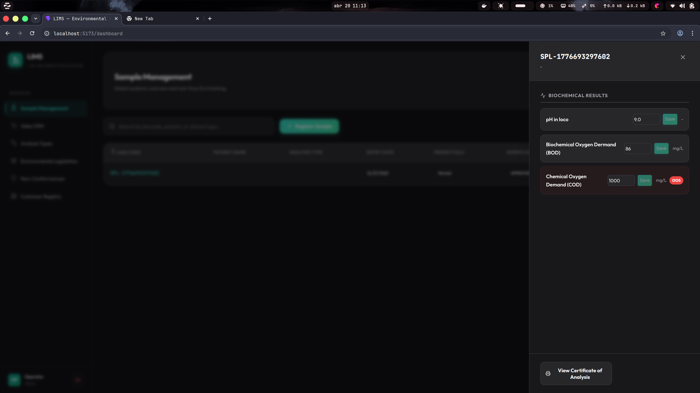
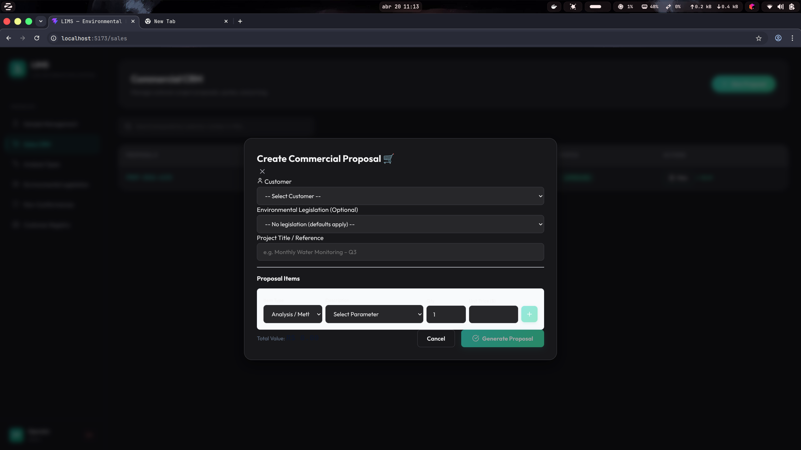
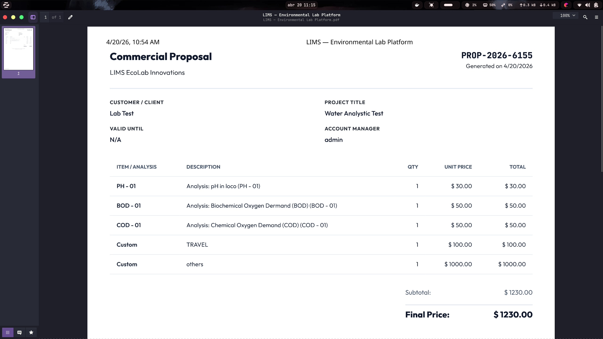
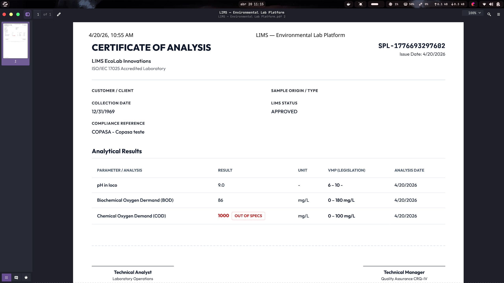

# EcoLab LIMS (Laboratory Information Management System) 🔬🌱

 
 
 
 


An **Enterprise-Grade Laboratory Information Management System** built specifically for environmental and chemical analysis laboratories. This system maps out the complete operational workflow—from commercial quoting and customer management down to technical sample tracking, parameter measurements, and automated release of official Analysis Certificates.

---

## 📸 System Walkthrough

https://www.youtube.com/watch?v=Yd0m5AZF5Vo

---

## 🚀 Key Technical Features

Unlike simple CRUD applications, this project implements a highly structured, domain-driven architecture tackling real-world business complexity.

### 1. Robust State Machine (Workflow Restrictions)
A defined lifecycle prevents illegal state transitions (e.g., a laboratory sample cannot be technically approved before it has been physically received).
- `PENDING_RECEIPT` ➔ `RECEIVED` ➔ `IN_ANALYSIS` ➔ `PENDING_APPROVAL` ➔ `APPROVED / RELEASED`

### 2. Environmental Compliance Engine (Dynamic VMPs)
Instead of static boundaries, the system supports dynamic **Environmental Legislations**. Technical analysts associate a sample with a specific environmental norm (e.g., Water Quality Act). The system automatically evaluates the typed analytical results against the **Maximum Permitted Values (VMP)** dictated by that specific legislation, visibly flagging *Out of Specs* (OOS) data.

> 

### 3. Automated Data Propagation (Commercial to Lab)
The Commercial CRM module communicates natively with the Operational module. When a **Commercial Proposal** is approved, the system automatically translates those requested analyses into tracking records, creating empty "Pending" test slots for the scientists to fill, eliminating duplicate data entry.






### 4. Database Auditing & Traceability (Hibernate Envers)
For compliance purposes, crucial tables (like Test Results and Sample details) have automated, full-version history tracking via **Hibernate Envers*. Any modification operation registers *who* changed it, *when*, and from *what* value to *what* value, ensuring absolute laboratory integrity.

### 5. Automated PDF Certificate Generation
Upon final approval by a Technical Manager, the platform dynamically generates a print-ready **Certificate of Analysis** (PDF format), listing methodology, units, the specific environmental legislation used as a parameter, and automatic highlighting of parameters that failed compliance.



---

## 🛠️ Technology Stack

**Backend (API Rest):**
*   **Java 21**
*   **Spring Boot 3.x** (Web, Data JPA, Validation, Security)
*   **Hibernate Envers** (Data Versioning & Auditing)
*   **Flyway** (Database Migration & Schema Versioning)
*   **PostgreSQL** (Relational Database)

**Frontend (SPA):**
*   **React 18** (Vite)
*   **TypeScript** (Strict Type Safety)
*   **React Query (TanStack)** (Server State Management & Caching)
*   **Lucide React** (Iconography)

---

## ⚙️ How to Run Locally

### Prerequisites
*   Java Development Kit (JDK) 21+
*   Node.js 18+ (with `npm` or `yarn`)
*   PostgreSQL 15+
*   Maven

### 1. Database Setup
Create an empty database in PostgreSQL named `lims_db`. Ensure your credentials in `lims-backend/src/main/resources/application.properties` match your local postgres instance.
```properties
spring.datasource.url=jdbc:postgresql://localhost:5432/lims_db
spring.datasource.username=postgres
spring.datasource.password=yourpassword
```

### 2. Run Backend (Spring Boot)
Open your terminal and navigate to the backend folder:
```bash
cd lims-backend
mvn clean install
mvn spring-boot:run
```
*(Note: Flyway will automatically run and create all necessary tables and audit schemas on startup).*

### 3. Run Frontend (React/Vite)
Open a new terminal tab and navigate to the frontend folder:
```bash
cd lims-frontend
npm install
npm run dev
```
The application will be accessible at: `http://localhost:5173`

---

## 🤝 Project Origin & Portfolio Notes

This project was built as an advanced technical demonstration of my ability to capture complex business logic (Domain Driven Design concepts), manage rigid relational persistence schemas, and deliver a clean, highly-interactive Full-Stack web application. 

Feel free to explore the codebase, especially `SampleService.java`, and the React `useClinicalMutations.ts` hooks for a deep dive into the implementations!

---
*Created by Vinicius Rodrigues Cruz*
